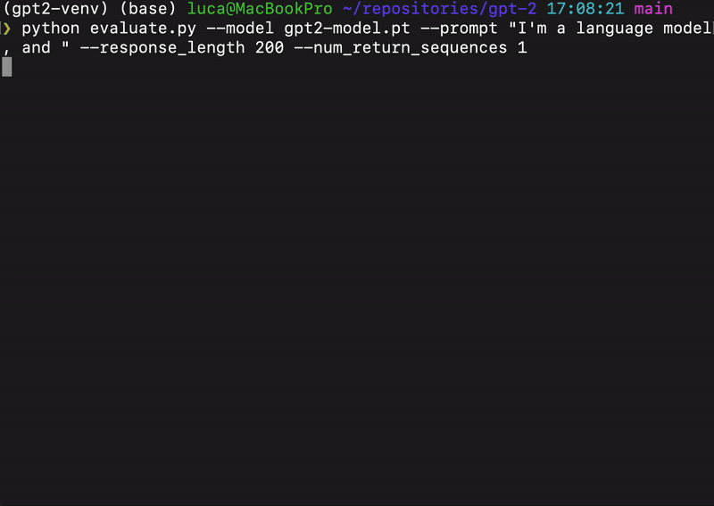

# GPT-2 Training and Evaluation

This repository provides code for training and evaluating GPT-2 models. It supports training on either the "Tiny Shakespeare" dataset or a sample of the "FineWeb-Edu" dataset. The project also includes functionality for evaluating the trained model on the HellaSwag benchmark. A Medium article related to the project is also available [here](https://medium.com/@pegolotti.luca/lets-reproduce-gpt-2-again-368711e0d1c5).

**Acknowledgement:** This codebase is heavily based on the accompanying materials for the YouTube video "[Let's reproduce GPT-2 (124M)](https://www.youtube.com/watch?v=l8pRSuU81PU&t=1787s)" by Andrej Karpathy. The `hellaswag.py` and `fineweb.py` files have been minimally edited from the original code provided in the video's context.

<p align="center">
  
</p>


## Files

  * `config.py`: Defines training hyperparameters and data-related configurations.
  * `create_venv.sh`: Script to set up a Python virtual environment.
  * `download_model.sh`: Download a pre-trained model to use for evaluation.
  * `data/dataloader.py`: Handles data loading and batching for training.
  * `data/fineweb.py`: Script to download and preprocess the FineWeb-Edu dataset.
  * `data/hellaswag.py`: Contains utilities for downloading and evaluating on the HellaSwag benchmark.
  * `data/tiny_shakespeare.txt`: The Tiny Shakespeare dataset.
  * `manager/device_manager.py`: Manages CUDA device and DistributedDataParallel (DDP) setup.
  * `manager/log_manager.py`: Handles logging of training and evaluation metrics.
  * `model/model.py`: Defines the GPT-2 model architecture.
  * `requirements.txt`: Lists all Python dependencies.
  * `run.sh`: Example script to run distributed training.
  * `train_gpt2.py`: The main script for training the GPT-2 model.
  * `evaluate.py`: Evaluation script.

## Setup

To set up the environment, follow these steps:

1.  **Create a Virtual Environment:**
    ```bash
    ./create_venv.sh
    ```
    This script will create a virtual environment named `gpt2-venv` in your repository root.
2.  **Activate the Virtual Environment:**
    ```bash
    . gpt2-venv/bin/activate
    ```
3.  **Install Dependencies:**
    Install the required Python packages:
    ```bash
    pip install -r requirements.txt
    ```

## Data Preparation

This repository supports two datasets:

  * **Tiny Shakespeare:** Already included in `data/tiny_shakespeare.txt`. This dataset is suitable for single-GPU training.
  * **FineWeb-Edu:** For larger-scale training, you can use the `data/fineweb.py` script to download and tokenize a sample of the FineWeb-Edu dataset. This will create a directory named `edu_fineweb10B` with data shards.
    ```bash
    python data/fineweb.py
    ```
  * **HellaSwag:** The HellaSwag evaluation script (`data/hellaswag.py`) will automatically download the necessary validation data when run.

## Training

To train the GPT-2 model:

1.  **Configure Training Parameters:**
    Edit `config.py` to adjust hyperparameters like `batch_size`, `max_steps`, and `dataset_name`. Set `dataset_name` to `"tiny_shakespeare"` or `"edu_fineweb10B"` as desired.
    ```python
    # config.py
    self.dataset_name = "tiny_shakespeare"  # or "edu_fineweb10B"
    ```
2.  **Run Training:**
    You can run training on a single GPU or in a distributed manner.
      * **Single GPU (Example):**
        ```bash
        python train_gpt2.py
        ```
      * **Distributed Training (Example with 8 GPUs):**
        ```bash
        ./run.sh
        ```
        This script uses `torchrun` for distributed training.

During training, the model will periodically log loss, learning rate, and gradient norm. It will also generate text samples and, if `do_evaluate_benchmark` is set to `True` in `config.py`, perform HellaSwag evaluation. Model checkpoints will be saved in the `log` directory.

## Evaluation

The `evaluate.py` script allows generating text from a pre-trained model, either provided as checkpoint file or a string to download the weights from the HuggingFace website. For now, the only supported model from HuggingFace is "gpt2". The following call loads weights from a pretrained model `gpt2-model.pt` and generates a response of 400 tokens:

```bash
python evaluate.py --model gpt2-model.pt --prompt "I'm a language model, and " --response_length 400 --num_return_sequences 1
```

A script to download a pretrained model is also available. To execute, run:
```bash
bash download_model.sh
```

## Configuration

The `config.py` file allows you to customize various aspects of the training process:

  * `batch_size`: Batch size per GPU.
  * `total_batch_size`: Total batch size across all GPUs, used to calculate gradient accumulation steps.
  * `max_lr`, `min_lr`: Maximum and minimum learning rates for cosine decay.
  * `warmup_steps`, `max_steps`: Learning rate schedule parameters.
  * `block_size`: Sequence length for the model.
  * `dataset_name`: Specifies which dataset to use (`"tiny_shakespeare"` or `"edu_fineweb10B"`).
  * `do_evaluate_benchmark`: Set to `True` to perform HellaSwag evaluation during training.